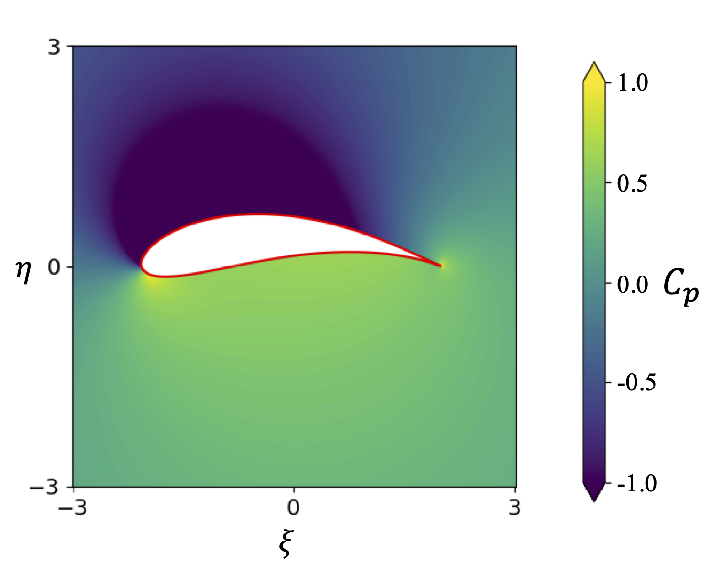

# airfoil-conformal-mapping

### ✈️ Conformal Mapping for Airfoil Lift Calculation

This repository implements and extends the conformal mapping method for computing lift over airfoils, following the classic Joukowski transform approach as taught in the lesson 6 assignment in [AeroPython](https://github.com/barbagroup/AeroPython) project.

> 📚 Based on:  
> **Barba, Lorena A., & Mesnard, Olivier (2019)**.  
> *AeroPython: classical aerodynamics of potential flow using Python.*  
> Journal of Open Source Education, 2(15), 45.  
> [https://doi.org/10.21105/jose.00045](https://doi.org/10.21105/jose.00045)

---

## 🔧 What This Repository Includes

### ✅ Implemented from AeroPython
- Joukowski transformation from a circle to an airfoil
- Flow around a circle (complex potential, velocity field)
- Conformal mapping to an airfoil and flow visualization
- Lift calculation using the Kutta–Joukowski theorem

The visualizations presented in the original AeroPython assignment are fully available in this project. After solving the conformal mapping problem, you can generate each plot with a simple call to the `.plot()` method of the `ConformalMapping` class.

✅ How It Works
Once the circle parameters have been optimized from the airfoil data and the solution computed, you can call:
```
cmapping.plot('<keyword>')
```
to generate specific visual outputs. Available plot keywords are 

Keyword | Description
'grid' | Displays the computational grid before and after the conformal transformation
'streamlines' | Shows the streamlines of the potential flow around the airfoil
'velocity' | Quiver plot of the velocity field in the physical domain
'pressure' | Contour plot showing the pressure field around the airfoil
'pressure_distribution' | Line plot showing pressure coefficient C_p​ along the airfoil surface
---

| Example | Plot | Description |
|--------|------|-------------|
| **Basic Plot** |  | `your_function_name(data)` |
| **Custom Color** |  | `your_function_name(data, color="red")` |
| **With Grid** |  | `your_function_name(data, grid=True)` |

## 🌟 My Additional Contribution: Inverse Design Optimization

### 🎯 Goal

Given a set of airfoil boundary points (generated via a Joukowski transform), automatically **find the optimal parameters of the generating circle** that best match this airfoil.

### 🧠 Methodology

I developed an optimization algorithm using `scipy.optimize` that:

- Takes as input: a 2D airfoil shape (e.g., from points or a file)
- Outputs: circle parameters `x0`, `y0`, and `R`
- Uses: mean squared error between the generated airfoil and target points
- Assumes: airfoil is created via a Joukowski transform

### 📈 Example

<p align="center">
  
</p>

*The algorithm
