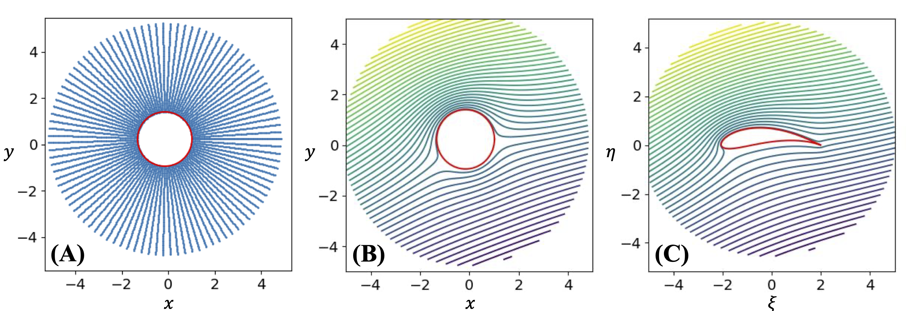
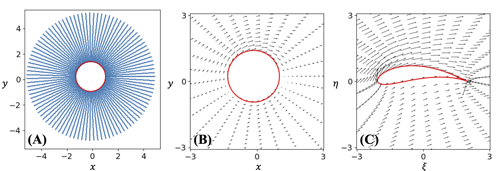
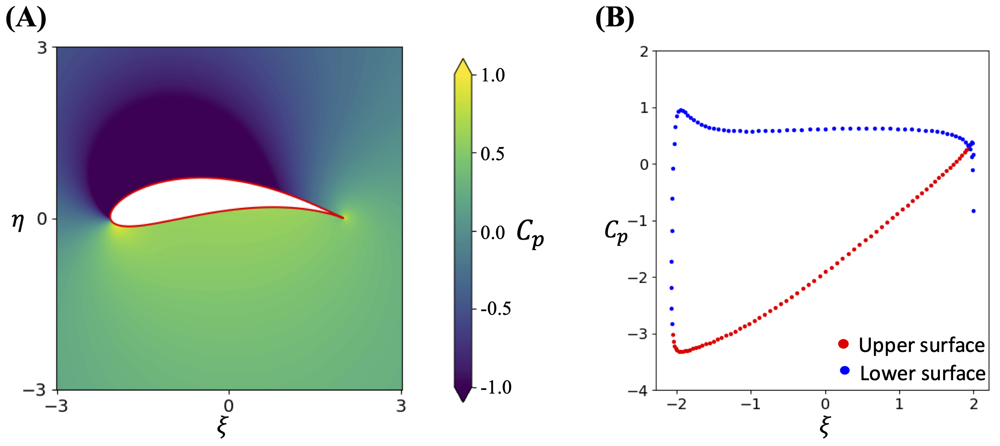
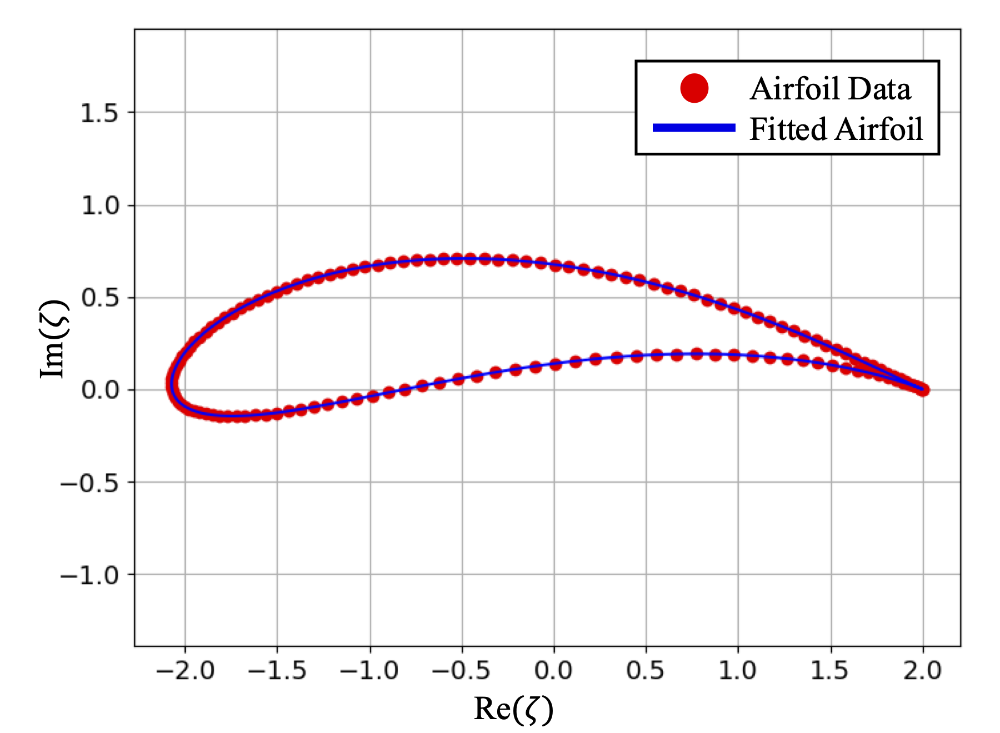
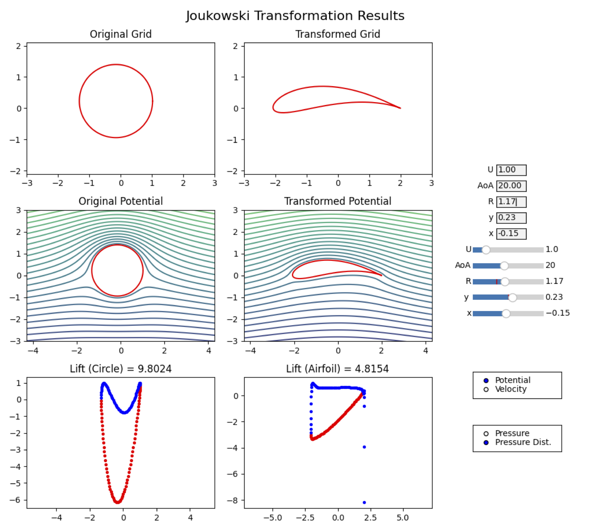
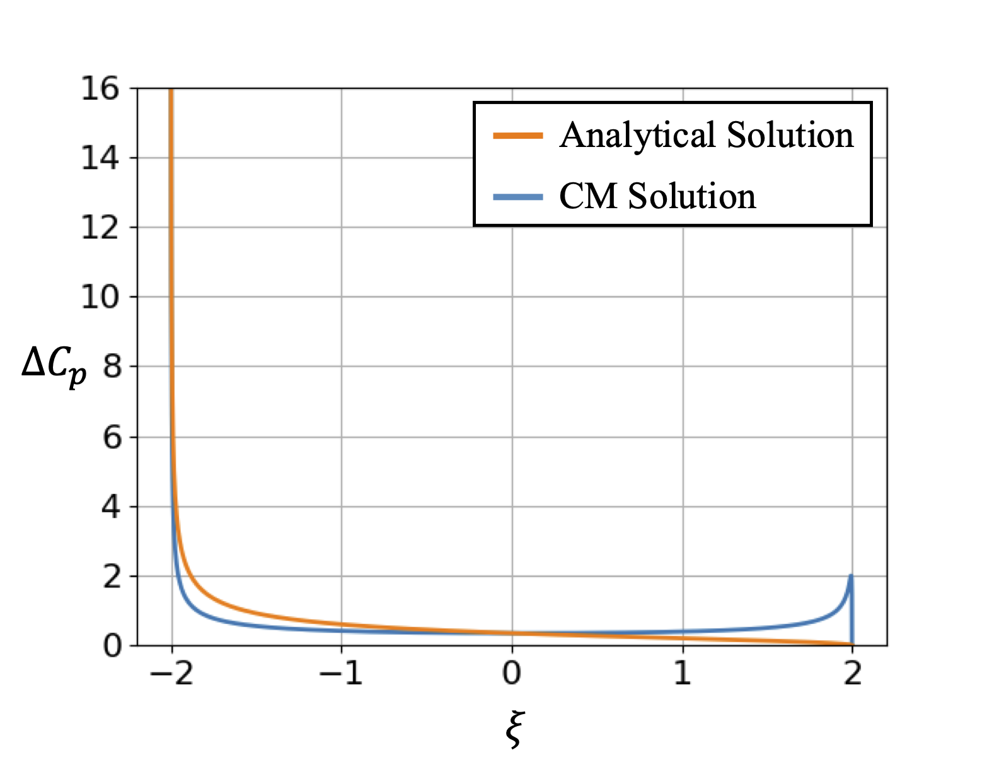

# airfoil-conformal-mapping

### ✈️ Conformal Mapping for Airfoil Lift Calculation

This repository implements the conformal mapping method for computing lift over airfoils. 

The conformal mapping method is a method that is based on mapping the analytical solution of a flow around a circle to an airfoil shape to obtain lift. Rather than discretizing the airfoil, this method aims to fit an airfoil with a Joukowsky transformation applied on a circle. The solution on the circle, thus, can also be transformed into the airfoil. Hence, this method avoids the errors caused by the discretization but is limited with the 2D lift calculation and cannot calculate the drag force. The code is based on the procedure provided in the lesson 6 assignment in [AeroPython](https://github.com/barbagroup/AeroPython) project.

> 📚 Based on:  
> **Barba, Lorena A., & Mesnard, Olivier (2019)**.  
> *AeroPython: classical aerodynamics of potential flow using Python.*  
> Journal of Open Source Education, 2(15), 45.  
> [https://doi.org/10.21105/jose.00045](https://doi.org/10.21105/jose.00045)

---

## 🚀 Getting Started

Clone the repository and install dependencies:

```bash
git clone https://github.com/yourusername/airfoil-conformal-mapping
cd airfoil-conformal-mapping
pip install -r requirements.txt
```

To run the example and generate the plots:

```bash
python example1.py
```

To launch the interactive GUI:
```bash
python example2.py
```

## 🔧 What This Repository Includes

#### ✅ Implemented from [AeroPython](https://github.com/barbagroup/AeroPython)
- Joukowski transformation from a circle to an airfoil
- Calculation of the streamlines and velocities
- Conformal mapping to an airfoil and flow visualization
- Pressure calculation utilizing Bernoulli

The visualizations presented in the original [AeroPython](https://github.com/barbagroup/AeroPython) assignment are generated in this project. After solving the conformal mapping problem, you can generate each plot with a simple call to the `.plot()` method of the `ConformalMapping` class. An example call to this method is below
```
cmapping.plot('<keyword>')
```
and the available plot keywords are 

| Keyword                | Description                                                                 |
|------------------------|-----------------------------------------------------------------------------|
| `'grid'`               | Displays the evaluation grid before and after the conformal transformation |
| `'streamlines'`        | Shows the streamlines around the circle and airfoil               |
| `'velocity'`           | Quiver plot of the velocity field in the both domains                     |
| `'pressure'`           | Contour plot showing the pressure field around the airfoil                   |
| `'pressure_distribution'` | Line plot showing pressure coefficient *Cₚ* along the airfoil surface        |

Utilizing these keywords, the following plots can be obtained. 


| Example         | Plot                                                                                     | Description                                                                 |
|----------------|------------------------------------------------------------------------------------------|-----------------------------------------------------------------------------|
| **Streamlines** | <div align="center"></div>           | **(A)** shows the evaluation points by using the `'grid'` keyword, while **(B)** and **(C)** visualize the streamlines using the `'streamlines'` keyword. |
| **Velocity**    | <div align="center"></div>            |**(A)** shows the evaluation points by using the `'grid'` keyword, while **(B)** and **(C)** visualize the velocity vectors using the `'velocity'` keyword. |
| **Pressure**    | <div align="center"></div>              | **(A)** shows the contour plot of pressure obtained by `'pressure'` keyword and **(B)** shows the pressure values along airfoil using the `'pressure_distribution'` keyword. |

The example code `example1.py` demonstrates this procedure thoroughly.

## 🌟 My Additional Contributions

### 1. Inverse Joukowski Optimization

#### 🎯 Goal

Given a set of airfoil boundary points (generated via a Joukowski transform), automatically **find the optimal parameters of the generating circle** that best match this airfoil.

#### 🧠 Methodology

I developed an optimization algorithm using `scipy.optimize` that:

- Takes as input: a 2D airfoil shape (e.g., from points or a file)
- Outputs: circle parameters `x0`, `y0`, and `R`
- Uses: mean squared error between the generated airfoil and target points
- Assumes: airfoil is created via a Joukowski transform

#### 📈 Example

<p align="center">
  
</p>

* However, the algorithm still needs improvement. Currently, it works only for airfoils generated by Joukowski transform and cannot find a close approximation to the ones that cannot be generated by Joukowski transform. 

### 2. Real-time GUI for Conformal Mapping Visualization

#### 🎯 Goal
To enhance the user experience, I developed a Graphical User Interface (GUI) that allows real-time visualization of the conformal mapping process, including changes in airfoil shape, velocity, pressure distribution, and streamlines. The GUI provides interactive sliders and input fields to adjust parameters and see their impact on the airfoil and flow field.

#### 📈 Example
The following screenshots illustrate the GUI in action. Users can adjust the generating circle's parameters and observe how the airfoil shape and flow field change in real-time.

<p align="center">  </p>

The activation of the GUI can be seen in the example code `example2.py`. 


### 3. Validation on a Flat Plate

When the circle is at the origin with the uniform radius, it results in a flat plate. The analytical solution around a flat plate is available.  The velocity at the flat plate can be calculated analytically as: 

$$
v_{\text{flat}} = U_\infty \left( \cos(\text{AoA}) \pm \sin(\text{AoA}) \right) \sqrt{\frac{L - 2 \xi}{L + 2 \xi}}
$$

where the sign is positive when it is the upper surface and negative when lower. The pressure differences between upper and lower surfaces $\Delta C_p = C_p^{low} - C_p^{up}$ can be calculated as seen in the figure below:

<p align="center">
  
</p>

Although the solutions seem to match in the middle, they are deviating towards the end. These might be caused by the numerical effects during the procedure. The grid is tuned to be finer. However, these deviations remained.
